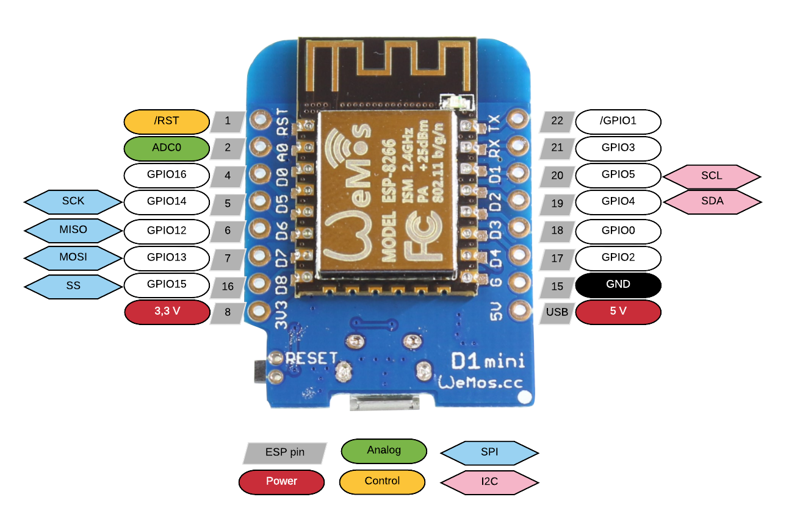

# Connected devices/Internet of Things

#### Guide til ESP moduler
Dette er DD Labs guide til hvordan man starter med at bruge den Arduino-kompatible WiFi-chip kaldet ESP. Denne chip eksisterer i mange former og i lab'et har vi følgende:
* [WeMos D1 mini](https://wiki.wemos.cc/products:d1:d1_mini#technical_specs)
* [Adafruit Feather Huzzar](https://learn.adafruit.com/adafruit-feather-huzzah-esp8266/overview)
* [NodeMCU](http://www.nodemcu.com/index_en.html)
* [Sparkfun ESP32 Thing](https://learn.sparkfun.com/tutorials/esp32-thing-hookup-guide) (der er endnu ikke en guide klar til denne)

Der findes mange forskellige platforme der understøtter ESP og flere af dem kan findes her ved at klikke ind i de ovenstående mapper. Snak gerne med en ansat i lab'et om en introduktion til de forskellige muligeder.
I lab'et anvender vi overvejende WeMos D1 mini, så det vil være den der referes til herunder. Bruger man en anden chip skal man vælge andet board inde i Arduino IDE'et.

#### Få hul igennem til ESP:
* Opdater jeres arduino IDE til nyeste version
* Installation
  * Driver:
    * Hent fra: http://www.silabs.com/products/mcu/Pages/USBtoUARTBridgeVCPDrivers.aspx
      * Der er flere macs der kan have problemer. Virker ovenstående driver ikke, så kan man hente den der passer til ens styresystem [her](https://kig.re/2014/12/31/how-to-use-arduino-nano-mini-pro-with-CH340G-on-mac-osx-yosemite.html#high-sierra). Det er primært High Sierra der har problemer.
    * Genstart jeres computer efter installation
  * Board:
    * Først skal Arduino IDE'et have et link, så den ved hvorfra den kan installere boardet:
      *  File -> Preferences -> Additional Boards Manager URLs: -> Indsæt her http://arduino.esp8266.com/stable/package_esp8266com_index.json -> Tryk OK
    * Derefter skal selve boardet installeres:
      * Tools -> Board -> Boards Manager -> Søg på "esp8266" -> Installer den nyeste version af "esp8266 by ESP8266 Community"
  * Test at det virker ved at oploade en blink sketch til boardet
    * Den kan i finde under File -> Examples -> ESP8266 -> Blink
    * Husk at vælge det rigtige board: Tools -> Board -> WeMos D1 R2 &Mini

# 3.3V Øvelser

Alle tutorials vi skal bruge i dag finder i på: [https://www.arduino.cc/en/Tutorial/BuiltInExamples](https://www.arduino.cc/en/Tutorial/BuiltInExamples)
    

## Det basale
Lav følgende tutorials i denne rækkefølge:  
2. [Blink](https://www.arduino.cc/en/Tutorial/Blink)
3. [Fade](https://www.arduino.cc/en/Tutorial/Fade)
4. [Analog Read Serial](https://www.arduino.cc/en/Tutorial/AnalogReadSerial)
5. [Digital Read Serial](https://www.arduino.cc/en/Tutorial/DigitalReadSerial)      
   
   
   
     
## Fri leg
Alle de følgende ting er rigtig gode, hvis ikke nødvendige, at kunne så snart man vil begynde at lave bare lidt mere komplekse projekter. 
* [Button](https://www.arduino.cc/en/Tutorial/Button)
* [Analog Input](https://www.arduino.cc/en/Tutorial/AnalogInput)

# MQTT & Shiftr test

Når vi tester shifter, bruger vi først https://shiftr.io/try. Her er der ikke et krav om at oprette hverken bruger eller eget namespace.
